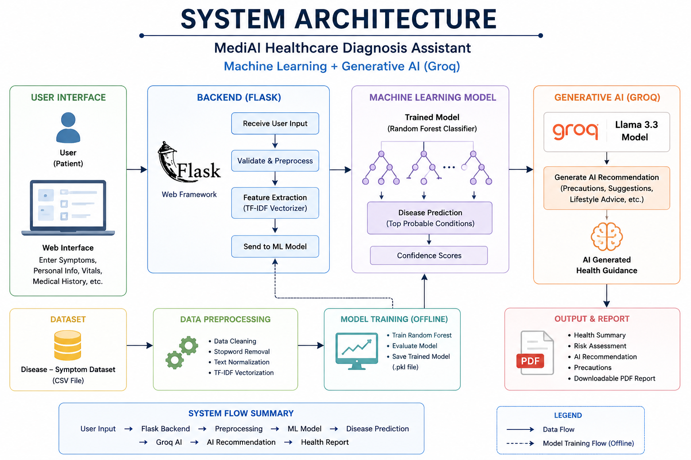

# MediAI Healthcare Diagnosis Assistant

MediAI is a Flask-based healthcare assessment web application that uses machine learning to suggest possible health conditions from user-entered symptoms. It also uses Generative AI through the Groq API to provide educational health guidance and creates a downloadable PDF report.

> Disclaimer: This project is for educational and demonstration purposes only. It is not a medical diagnosis tool and must not replace consultation with a qualified healthcare professional.

## Features

- Patient information collection
- Symptom-based disease prediction
- BMI calculation and BMI category
- Risk level calculation using age, severity, temperature, and SpO2
- Health score and health summary
- Emergency symptom detection
- Top possible disease predictions with confidence scores
- AI-generated educational healthcare advice
- PDF report generation
- Simple Flask web interface

## Technology Stack


## Project Structure


## System Architecture




## Machine Learning Workflow

1. Load the dataset from `dataset/disease_sympts_prec_full.csv`.
2. Use the `symptoms` column as input features.
3. Use the `disease` column as the prediction target.
4. Convert symptom text into numerical vectors using `TfidfVectorizer`.
5. Train a `RandomForestClassifier`.
6. Evaluate the model using accuracy score.
7. Save the trained model to `model/model.pkl`.
8. Save the vectorizer to `model/vectorizer.pkl`.
9. During prediction, transform user symptoms and return top disease probabilities.

## Setup Instructions

### 1. Create and activate a virtual environment

```bash
python -m venv venv
```

On Windows:
```bash
venv\Scripts\activate
```

On macOS/Linux:
```bash
source venv/bin/activate
```

### 2. Install dependencies
```bash
pip install -r requirements.txt
```

### 3. Configure Groq API key
Create a `.env` file in the project root:

```env
GROQ_API_KEY=your_groq_api_key_here
```

### 4. Train the model

If model files are missing or you update the dataset, run:

```bash
python train_model.py
```

This creates:

```text
model/model.pkl
model/vectorizer.pkl
```

### 5. Run the Flask app

```bash
python app.py
```

Open the app in your browser:

```text
http://127.0.0.1:5000
```

## Main Files

### `app.py`

Main Flask application. Handles routes, form submission, health calculations, ML prediction, AI advice, and report generation.

### `predict.py`

Loads the trained model and vectorizer, predicts possible diseases, calculates confidence scores, and retrieves precautions.

### `train_model.py`

Trains the machine learning model using the disease and symptom dataset.

### `utils.py`

Contains helper functions for BMI, risk level, temperature status, oxygen status, emergency check, and health score.

### `groq_helper.py`

Connects to the Groq API and generates educational health recommendations.

### `report_generator.py`

Creates a PDF health assessment report using ReportLab.

## Verification

The project was checked with:

```bash
python -m py_compile app.py predict.py utils.py report_generator.py groq_helper.py train_model.py
pip install --dry-run -r requirements.txt
```

A Flask `/predict` smoke test was also run with the AI response mocked locally. The route returned `200` and generated `static/report.pdf`.

## Important Notes

- A valid `GROQ_API_KEY` is required for live AI recommendations.
- The generated PDF is saved at `static/report.pdf`.
- This app should be used only for educational purposes.
- Users with severe or emergency symptoms should seek immediate medical care.
